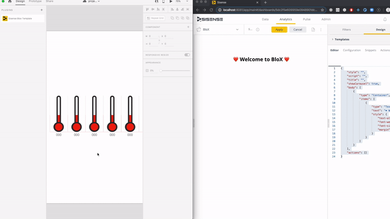

# Sisense BloX Template Generator for Adobe XD

This Adobe XD plugin runs inside the Adobe XD software and helps Sisense users to generate [Sisense BloX](https://www.sisense.com/marketplace/blox-widgets/) templates with the blink of an eye!



## Installing the Plugin

To install this plugin in Adobe XD from the Adobe Marketplace:

1. Launch [Adobe XD](https://www.adobe.com/products/xd.html)
1. Search for Sisense on the plugins marketplace inside Adobe XD
1. Install it, done! 👍

## Using the Plugin

1. Draw something you want to convert into a graph
1. Add input text elements (each one of them will be loaded with a dynamic value afterwards)
1. Select your complete design 
1. Click on the Sisense plugin on the plugins navigation bar or `Ctrl+Option+C` on mac or `Ctrl-Alt-C` on PC.
1. After the success message your template will be copied to clipboard
1. Paste the template code into [BloX](https://www.sisense.com/marketplace/blox-widgets/) code editor
1. Rename your value labels to `textvalue0` or any number according to the amount of text labels you've added.

## Collaboration Guidelines

* You may contribute to this project by submitting a Merge Request
* Document your code with inline comments
* Do not use any dependencies that have a stricter license than this project

## Development Guidelines

### Setting Up

1. In Adobe XD, search for Plugins > Development > Show Develop Folder 
1. Clone this repo to a folder within the Adobe XD Develop Folder
1. Run `yarn dev`
1. Edit with your favorite IDE


### Validation and Deployment

To validate the plugin before publish run this command:

```
yarn plugin:validation
```

To publish the plugin run this command:

```
yarn plugin:publish
```

### Debugging 

To open debbug console open Adobe XD and navigate to Plugins > Development > Developer Console 

You can now debug!

